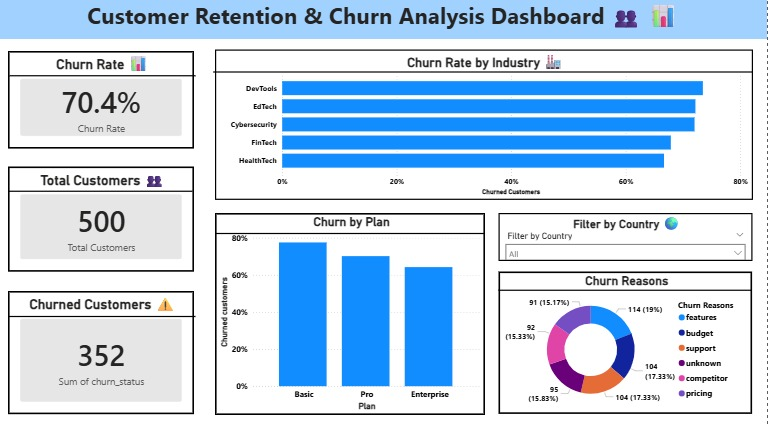

# Customer Retention & Churn Analysis (Task 2)

## Overview

This project focuses on analyzing customer churn and retention patterns for a subscription-based business.

The goal is to understand:

* How many customers are leaving
* Which segments have higher churn
* Why customers are leaving
* What actions can reduce churn

## 📁 Dataset Used

## Dataset
* SaaS Subscription & Churn Analytics Dataset
* Link: https://www.kaggle.com/datasets/rivalytics/saas-subscription-and-churn-analytics-dataset

The following datasets were used:

* `ravenstack_accounts.csv` → customer details (industry, country, churn flag)
* `ravenstack_subscriptions.csv` → subscription details (plan, start date, billing)
* `ravenstack_churn_events.csv` → churn events and reasons

## 🛠️ Tools Used

* Python (Pandas) → data cleaning and merging
* Power BI → dashboard creation

## 🔧 Data Preparation Steps

* Loaded all datasets into dataframes
* Checked duplicates using `account_id`
* Handled multiple records in subscriptions by keeping the latest record per account
* Created churn status using churn date:

  * 1 → churned
  * 0 → active
* Merged datasets using `account_id` to create a final dataset
* Merged datasets using account_id to create a final dataset (main.csv)
* The main.csv and churn_reasons.csv was used for analysis and dashboard creation

## 📊 Analysis Performed

### 1. Churn Rate

* Calculated overall churn rate using average of churn status

### 2. Churn by Industry

* Compared churn rates across industries

### 3. Churn by Plan

* Compared churn across subscription plans (Basic, Pro, Enterprise)

### 4. Churn Reasons

* Analyzed why customers left using reason codes

## 📈 Dashboard

A Power BI dashboard was created including:

* KPI Cards:

  * Total Customers
  * Churned Customers
  * Churn Rate

* Charts:

  * Churn Rate by Industry
  * Churn Rate by Plan
  * Churn Reasons (Donut Chart)

* Slicer:

  * Country filter for interactive analysis

## 🔍 Key Insights

* Basic plan customers show higher churn compared to higher plans
* Feature-related issues are the most common churn reason
* Some industries (like DevTools and EdTech) show higher churn rates

## 💡 Conclusion

This analysis helps identify:

* High-risk customer segments
* Main reasons for churn
* Areas where the business can improve retention

## 📷 Dashboard Preview



## 📌 Folder Structure

```
Task2/
│
├── Data/
│   ├── ravenstack_accounts.csv
│   ├── ravenstack_subscriptions.csv
│   ├── ravenstack_churn_events.csv
│
├── analysis.py
├── task2_dashboard1.pbix
├── README.md
├── main.csv
├── Task2_Dashboard1.png
```
